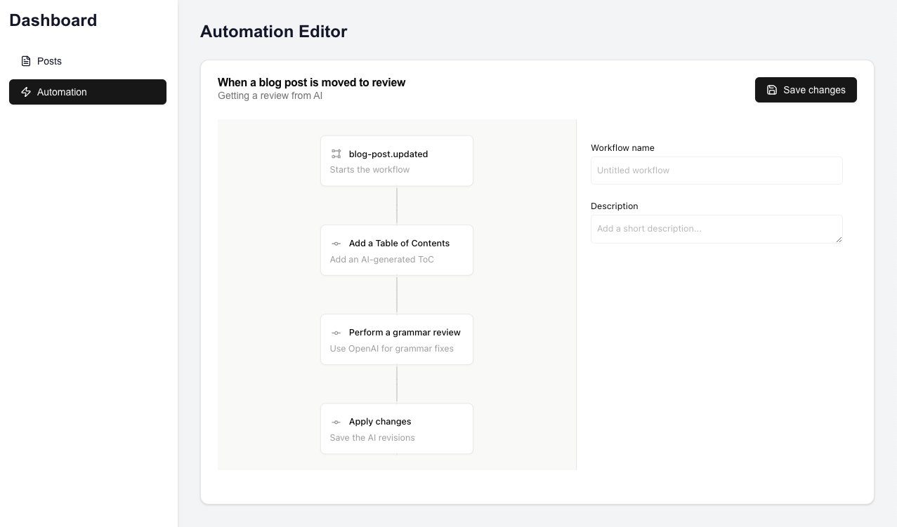

## Blog AI workflows | Next.js template

<p align="center">



</p>

<p align="center">
    <a href="https://www.inngest.com/docs?ref=github-workflow-sdk-example-nextjs-blog-cms-readme">Documentation</a>
    <span>&nbsp;·&nbsp;</span>
    <a href="https://www.inngest.com/blog?ref=github-workflow-sdk-example-nextjs-blog-cms-readme">Blog</a>
    <span>&nbsp;·&nbsp;</span>
    <a href="https://www.inngest.com/discord">Community</a>
</p>
<br/>

This demo is Next.js blog back-office featuring some AI workflows helping with grammar fixes, generating Table of Contents or Tweets, built with [Inngest](https://www.inngest.com/?ref=github-workflow-sdk-example-nextjs-blog-cms-readme), [Supabase](https://supabase.com) and [OpenAI](https://github.com/openai/openai-node).

Get started by cloning this repo and following the below setup instructions or directly deploy this template on Vercel.

- [Getting Started - Local setup](#getting-started-local-setup)
  - [0. Prerequisites](#0-prerequisites)
  - [1. Setup](#1-setup)
  - [2. Database setup](#2-database-setup)
  - [3. Starting the application](#3-starting-the-application)
- [Getting Started - Vercel/Deployment setup](#getting-started-verceldeployment-setup)
  - [0. Prerequisites](#0-prerequisites-1)
  - [1. Deploy on Vercel](#1-deploy-on-vercel)
  - [2. Inngest Integration setup](#2-inngest-integration-setup)
  - [3. Database setup](#3-database-setup)
- [Demo tour](#demo-tour)

## Getting Started - Local setup

### 0. Prerequisites

To run this demo locally, you'll need the following:

- a [Supabase account](https://supabase.com)
- an [OpenAI account](https://platform.openai.com/)

### 1. Setup

1. First, clone the repository and navigate the `examples/` folder:

```
git clone

cd examples/nextjs-blog-cms
```

2. Then, install the dependencies:

```bash
npm i
# or
yarn
# or
pnpm
```

3. Finally, copy your local `.env.example` as `.env.local` and fill your `OPENAI_API_KEY`.

### 2. Database setup

This project needs a database to store the blog posts and workflows.

Follow the below steps to get a database up and running with Supabase:

1. Go to [your Supabase Dashboard](https://supabase.com/dashboard/projects) and create a new project
1. While your database is being created, update your `.env.local` and fill the `NEXT_PUBLIC_SUPABASE_URL` and `NEXT_PUBLIC_SUPABASE_ANON_KEY`
1. Open the SQL Editor from the left side navigation, and copy the content of the `examples/nextjs-blog-cms/supabase/schema.sql` file
1. Still in the SQL Editor, create a new snippet and do the same with the `examples/nextjs-blog-cms/supabase/seed.sql` file
1. Navigate to the Table Editor, you should see two tables: `blog_posts` and `workflows`

You are all set, your database is ready to be used!

### 3. Starting the application

First, start the Next.js application:

```bash
npm run dev
# or
yarn dev
# or
pnpm dev
# or
bun dev
```

Open [http://localhost:3000](http://localhost:3000) with your browser to see the application. See our [Demo Tour section](#demo-tour) to trigger your first workflow.

Finally, start the Inngest Dev Server by running the following command:

```
npx inngest-cli@latest dev
```

Open [http://localhost:8288](http://localhost:8288) with your browser to explore the [Inngest Dev Server](https://www.inngest.com/docs/dev-server?ref=github-workflow-sdk-example-nextjs-blog-cms-readme).

## Getting Started - Vercel/Deployment setup

### 0. Prerequisites

To run this demo locally, you'll need the following:

- an [Inngest account](https://www.inngest.com/?ref=github-workflow-sdk-example-nextjs-blog-cms-readme)
- a [Supabase account](https://supabase.com)
- an [OpenAI account](https://platform.openai.com/)

### 1. Deploy on Vercel

Use the below button to deploy this template to Vercel:

[](https://vercel.com/new/clone?repository-url=https%3A%2F%2Fgithub.com%2Finngest%2Fworkflow-sdk%2Ftree%2Fmain%2Fexamples%2Fnextjs-blog-cms%2F&project-name=nextjs-blog-cms-ai-workflow-with-inngest&repository-name=workflow-sdk&demo-title=nextjs-blog-cms-ai-workflow-with-inngest&demo-description=Next.js%20blog%20back-office%20featuring%20some%20AI%20workflows%20helping%20with%20grammar%20fixes%2C%20generating%20Table%20of%20Contents%20or%20Tweets&demo-image=)

**Once deployed, make sure to configure your `OPENAI_API_KEY` environment variable.**

### 2. Inngest Integration setup

Navigate to the [Inngest Vercel Integration page](https://vercel.com/integrations/inngest) and follow the instructions to link your Vercel application with Inngest.

### 3. Database setup

This project needs a database to store the blog posts and workflows.

Follow the below steps to get a database up and running with Supabase:

1. Go to [your Supabase Dashboard](https://supabase.com/dashboard/projects) and create a new project
1. While your database is being created, update your Vercel project environment variables: `NEXT_PUBLIC_SUPABASE_URL` and `NEXT_PUBLIC_SUPABASE_ANON_KEY`
1. Open the SQL Editor from the left side navigation, and copy the content of the `examples/nextjs-blog-cms/supabase/schema.sql` file
1. Still in the SQL Editor, create a new snippet and do the same with the `examples/nextjs-blog-cms/supabase/seed.sql` file
1. Navigate to the Table Editor, you should see two tables: `blog_posts` and `workflows`

You are all set, your database is ready to be used!

## Demo tour

This template is shipped with a Database seed containing three blog posts (two drafts) and two workflows.

Here are some suggestions of steps to follow as a tour of this demo:

### 1. Configuring an automation

1. Navigate to the automation tab
1. Click "Configure" on the "When a blog post is moved to review" automation
1. Hover the "blog-post.updated" node to click on the "+" icon
1. Select "Add a Table of Contents" on the right side panel
1. Add another step from "Add a Table of Contents" by using the "+" icon and select "Perform a grammar review"
1. Finally, add a "Apply changes after approval" as a final step
1. Click on "Save changes" at the top right

### 2. Move a blog post to review

We now have an active automation that will trigger when a blog post moves to review.

Let's trigger our automation:

1. Navigate to the blog posts page
1. Click on "Send to review" on the draft blog post
1. Navigate to your [Inngest Dev Server](http://localhost:8288) or [Inngest Platform](https://app.inngest.com/?ref=github-workflow-sdk-example-nextjs-blog-cms-readme) and go over the "Runs" tab
1. You can now see your automation running live, step by step, to finally pause
1. Return to the demo app, the blog post should have the "Needs approval" status. Click on "Review" and compare the Original blog post with the AI revision using the tabs.
1. At the bottom, click on the "Approve suggestions & Publish" button
1. Back on the Runs page of the [Inngest Dev Server](http://localhost:8288) or [Inngest Platform](https://app.inngest.com/?ref=github-workflow-sdk-example-nextjs-blog-cms-readme), you see the workflow in a completed state.
1. Going back to the demo application, on the "blog posts" tab, the blog post should be flagged as "Published"
